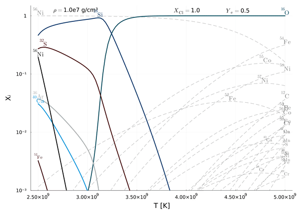

Pia Jakobus (2020) 
This code computes abundances in statistical partial equilibrium

The code was implemented based on the theory by  

Bodansky, David, Donald D. Clayton, and William A. Fowler. "Nuclear quasi-equilibrium during silicon burning." The Astrophysical Journal Supplement Series 16 (1968): 299. 

and for further read 

Hix, W. Raphael, and F-K. Thielemann. "Silicon Burning I: Neutronization and the Physics of Quasi-Equilibrium." arXiv preprint astro-ph/9511088 (1995).

Hix, W. Raphael, and Friedrich-Karl Thielemann. "Silicon burning. II. Quasi-equilibrium and explosive burning." The Astrophysical Journal 511.2 (1999): 862.

This directory also contains plotting routines in /plotting_routines for the animations below which can be used as a template for plotting in Julia 
 
Notes:
cgs units - rho = const = 1.0e7 g/cm3
load data in variable with load("data.jld")["data"]
y-range, T-range

# DEMO
## Example output for varying the silicon cluster size

## Example output for varying electron fraction 

